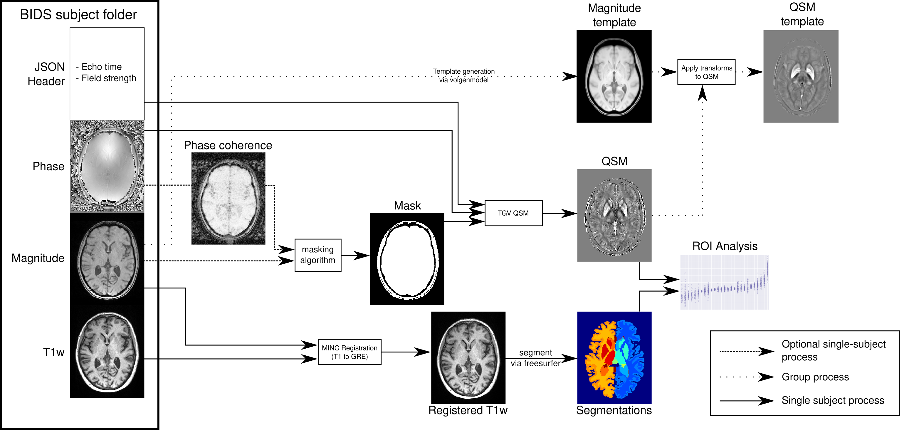

# QSMxT: A Complete QSM Processing Framework

QSMxT is a complete and end-to-end QSM processing and analysis framework that excels at automatically reconstructing and processing QSM for large groups of participants. 

QSMxT provides pipelines implemented in Python that:

1. Automatically convert unorganised DICOM or NIfTI data to the Brain Imaging Data Structure (BIDS)
2. Automatically reconstruct QSM, including steps for:
   1. Robust masking without anatomical priors
   2. Phase unwrapping (Laplacian based)
   3. Background field removal + dipole inversion (`tgv_qsm`)
   4. Multi-echo combination
3. Automatically generate a common group space for the whole study, as well as average magnitude and QSM images that facilitate group-level analyses.
4. Automatically segment T1w data and register them to the QSM space to extract quantitative values in anatomical regions of interest.
5. Export quantitative data to CSV for all subjects using the automated segmentations, or a custom segmentation in the group space (we recommend ITK snap http://www.itksnap.org/pmwiki/pmwiki.php to perform manual segmenations).

QSMxT's containerised implementation makes all required external dependencies available in a reproducible and scalable way, supporting MacOS, Windows and Linux, and with options for parallel processing via PBS systems.

If you use QSMxT for a study, please cite https://onlinelibrary.wiley.com/doi/10.1002/mrm.29048 (or the preprint https://doi.org/10.1101/2021.05.05.442850.)



## Installation
### install and start via Neurodesk project

A user friendly way of running QSMxT in Windows, Mac or Linux is via the NeuroDesktop provided by the NeuroDesk project:

1. Install [Docker](https://www.docker.com/)
2. Install [Neurodesktop](https://neurodesk.github.io)
3. Run the Neurodesktop container and open it in a browser window
4. Start QSMxT from the applications menu in the desktop
   (*Neurodesk* > *Quantitative Imaging* > *qsmxt*)
3. Follow the QSMxT usage instructions in the section below. Note that the `/neurodesktop-storage` folder is shared with the host OS for data sharing purposes (usually in `~/neurodesktop-storage` or `C:/neurodesktop-storage`). Begin by copying your DICOM data (or NIfTI data) into a folder in this directory on the host OS, then reach the folder by entering `cd /neurodesktop-storage` into the QSMxT window.

#### Updating QSMxT within Neurodesk

To use the latest version of the QSMxT container within an older version of Neurodesk, use:

```
bash /neurocommand/local/fetch_and_run.sh qsmxt 1.1.13 20221024
```

### Docker container

There is also a docker image available:

For Windows:
```
docker run -it -v C:/neurodesktop-storage:/neurodesktop-storage vnmd/qsmxt_1.1.13:20221123
```
For Linux/Mac:
```
docker run -it -v ~/neurodesktop-storage:/neurodesktop-storage vnmd/qsmxt_1.1.13:20221123
```

## QSMxT Usage
1. Convert DICOM or NIfTI data to BIDS:
    ```bash
    # DICOM TO BIDS (recommended)
    run_0_dicomSort.py REPLACE_WITH_YOUR_DICOM_INPUT_DATA_DIRECTORY 00_dicom
    run_1_dicomConvert.py 00_dicom 01_bids

    # NIFTI TO BIDS (if DICOMs are not available)
    run_1_niftiConvert.py REPLACE_WITH_YOUR_NIFTI_INPUT_DATA_DIRECTORY 01_bids
    ```
    - If converting from DICOMs, carefully read the output of the `run_1_dicomConvert.py` script to ensure data were correctly recognized and converted. You can also pass command line arguments to identify the acquisition protocol names, e.g. `run_1_dicomConvert.py 00_dicom 01_bids --t2starw_protocol_patterns *gre* --t1w_protocol_patterns *mp2rage*`.

    - If converting from NIfTI, carefully read the output of the `run_1_niftiConvert.py` script to ensure data were correctly recognized and converted. The script will try to identify any important details from the filenames and from adjacent JSON header files, if available. It retrieves this information using customisable patterns and regular expressions which can be overridden using command-line arguments (see the output using the `--help` flag). If any information is missing, you will be prompted to fill out a CSV spreadsheet with the missing information before running the conversion script again using the same command. You can open the CSV file in a spreadsheet reader such as Microsoft Excel or LibreOffice Calc.

2. Run QSM pipeline:
    ```bash
    run_2_qsm.py 01_bids 02_qsm_output
    ```
3. Segment data (T1 and GRE):
    ```bash
    run_3_segment.py 01_bids 03_segmentation
    ```
4. Build magnitude and QSM group template (only makes sense when you have more than about 30 participants):
    ```bash
    run_4_template.py 01_bids 02_qsm_output 04_template
    ```
5. Export quantitative data to CSV using segmentations
    ```bash
    run_5_analysis.py --labels_file /opt/QSMxT/aseg_labels.csv --segmentations 03_segmentation/qsm_segmentations/*.nii --qsm_files 02_qsm_output/qsm_final/*/*.nii --out_dir 06_analysis
    ```
6. Export quantitative data to CSV using a custom segmentation
    ```bash
    run_5_analysis.py --segmentations my_segmentation.nii --qsm_files 04_qsm_template/qsm_transformed/*/*.nii --out_dir 07_analysis
    ```

## Common errors and workarounds
1. Return code: 137

If you run `run_2_qsm.py 01_bids 02_qsm_output` and you get this error:
```
Resampling phase data...
Killed
Return code: 137
``` 
This indicates insufficient memory for the pipeline to run. Check in your Docker settings if you provided sufficent RAM to your containers (e.g. a 0.75mm dataset requires around 20GB of memory)

2. RuntimeError: Insufficient resources available for job
This also indicates that there is not enough memory for the job to run. Try limiting the CPUs to about 6GB RAM per CPU. You can try inserting the option `--n_procs 1` into the commands to limit the processing to one thread, e.g.:
```bash
run_2_qsm.py 01_bids 02_qsm_output --n_procs 1
```

3. If you are getting the error "Insufficient memory to run QSMxT (xxx GB available; 6GB needed)
This means there is not enough memory available. Troulbeshoot advice when running this via Neurodesk is here: https://neurodesk.github.io/docs/neurodesktop/troubleshooting/#i-got-an-error-message-x-killed-or-not-enough-memory

### Linux installation via Transparent Singularity (supports PBS and High Performance Computing)

The tools provided by the QSMxT container can be exposed and used using the QSMxT Singularity container coupled with the transparent singularity software provided by the Neurodesk project. Transparent singularity allows the QSMxT Python scripts to be run directly within the host OS's environment. This mode of execution is necessary for parallel execution via PBS.

1. Install [singularity](https://sylabs.io/guides/3.0/user-guide/quick_start.html)
   
2. Install the QSMxT container via [transparent singularity](https://github.com/neurodesk/transparent-singularity):

    ```bash
    git clone https://github.com/NeuroDesk/transparent-singularity qsmxt_1.1.13_20221123
    cd qsmxt_1.1.13_20221123
    ./run_transparent_singularity.sh --container qsmxt_1.1.13_20221123.simg
    source activate_qsmxt_1.1.13_20221123.simg.sh
    ```
    
    - **NOTE:** You must have sufficient storage available in `$SINGULARITY_TMPDIR` (by default `/tmp`), `$SINGULARITY_CACHEDIR` (by default `$HOME/.singularity/cache`), and the repository directory to store the QSMxT container.

3. Clone the QSMxT repository:
    ```bash
    git clone https://github.com/QSMxT/QSMxT.git
    ```

4. Install miniconda with nipype:
```bash
wget https://repo.anaconda.com/miniconda/Miniconda3-4.7.12.1-Linux-x86_64.sh	
bash Miniconda3-4.7.12.1-Linux-x86_64.sh -b
source ~/.bashrc
conda create -n qsmxt python=3.8
conda activate qsmxt
pip install psutil datetime nipype nibabel nilearn scipy pydicom osfclient pytest seaborn; pip install cloudstor
```

5. Invoke QSMxT python scripts directly (see QSMxT Usage above). Use the `--pbs` flag with your account string to run on an HPC supporting PBS.

### Bare metal installation
Although we do not recommend installing the dependencies manually and we advocate the use of software containers for reproducibility and ease-of-use, you can install everything by hand. These are the dependencies required and this was tested in Ubuntu 18.04: 

You need:
- TGV-QSM running in miniconda 2
- bet2 (https://github.com/liangfu/bet2)
- ANTs version=2.3.4
- dcm2niix (https://github.com/rordenlab/dcm2niix)
- miniconda version=4.7.12.1 with python3.8 and pip packages psutil, datetime, nipype, nibabel, nilearn, scipy, pydicom, osfclient, cloudstor, pytest and seaborn
- FastSurfer (https://github.com/Deep-MI/FastSurfer.git)
- Bru2Nii v1.0.20180303 (https://github.com/neurolabusc/Bru2Nii/releases/download/v1.0.20180303/Bru2_Linux.zip)
- julia-1.6.1 with ArgParse, MriResearchTools, FFTW and RomeoApp (see https://github.com/korbinian90/RomeoApp.jl)

Here is the detailed instruction that you could replicate: https://github.com/NeuroDesk/neurocontainers/blob/master/recipes/qsmxtbase/build.sh and then on top https://github.com/NeuroDesk/neurocontainers/blob/master/recipes/qsmxt/build.sh
